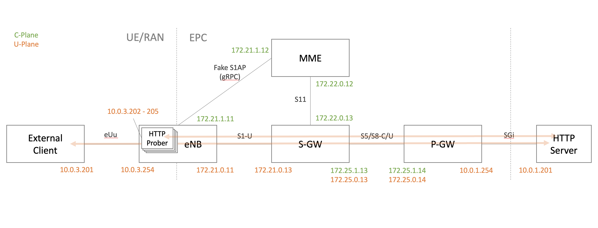

# GW Tester

## Summary

This project provides instructions required to setup the demo
described by *Yoshiyuki Kurauchi* in [this post][1].

### Concepts

* **User Equipment (UE):** This is the device that requests
connectivity to the network and downloads/uploads any data.
* **Evolved UMTS Terrestrial Radio Access Network (E-UTRAN):** The
network of antennas or Evolved Node B (EnodeB), gives radio access to
the UE anywhere there is coverage.
* **Public Data Network (PDN):** It is a shared network that is
accessed by users that belong to different organizations.
* **Evolved Packet Core (EPC):** It validates the session request from
the UE, generates a PDP context and gives access to the PDN.
  - *Mobility Management Entity (MME):* It does all the signaling for
the mobile devices but does not process any user data traffic. An MME
will provide session and mobility management for users. In addition,
it tracks the location of the UE and selects the S-GW and P-GW that
should serve this UE.
  - *Serving Gateway (S-GW):* In order to eliminate any effect on user
data while the UE moves between different eNodeBs, the S-GW works as
an anchor point for the user data of the UE, while the UE is moving
between different eNodeBs.
  - *PDN Gateway (P-GW):* This is the node that connects between the
LTE network and the PDN.

### LTE EPC Network Interfaces

* **S1-U:** Interface for S1 user plane data for each bearer between
the EnodeB and S-GW. Provides non guaranteed data delivery
of user plane Protocol Data Units (PDUs).
* **S1-MME:** Responsible for delivering signaling protocols
between the EnodeB and the MME. Consists of a Stream Control
Transmission Protocol (SCTP) over IP. The application signaling
protocol is an S1-AP (Application Protocol).
* **S11:** Interface defined between the MME and S-GW for EPS
management.
* **S5/S8:**: Provides user plane tunneling and tunnel management
function between the S-GW and P-GW. It enables S-GW to connect to
multiple P-GWs for providing different IP services to the UE. Also
used for S-GW relocation associated with the UE mobility. In principle
S5 and S8 is the same interface, the difference being that S8 is used
when roaming between different operators while S5 is network internal.
* **SGi:** Interface is used between P-GW and intranet or internet.

## Parameters

The following table lists the configurable parameters of the GW Tester
chart and their default values.

### Global parameters

| Parameter       | Description                        | Default       |
|:----------------|:-----------------------------------|:--------------|
| `s11.name`      | S11 Network name                   | `lte-s11`     |
| `s11.interface` | S11 Network interface              | `net1`        |
| `s1u.name`      | S1 User Plane Network name         | `lte-s1u`     |
| `s1u.interface` | S1 User Plane Network interface    | `net2`        |
| `s1c.name`      | S1 Control Plane Network name      | `lte-s1c`     |
| `s1c.interface` | S1 Control Plane Network interface | `net2`        |
| `s5u.name`      | S5 User Plane Network name         | `lte-s5u`     |
| `s5u.interface` | S5 User Plane Network interface    | `net3`        |
| `s5c.name`      | S5 Control Plane Network name      | `lte-s5c`     |
| `s5c.interface` | S5 Control Plane Network interface | `net4`        |
| `sgi.name`      | SGi Network name                   | `lte-sgi`     |
| `sgi.interface` | SGi Network interface              | `net5`        |
| `sgi.subnet`    | SGi Subnet                         | `10.0.1.0/24` |
| `euu.name`      | EU User plane Network name         | `lte-euu`     |
| `euu.interface` | EU User plane Network interface    | `net1`        |

[1]: https://wmnsk.com/posts/20200116_gw-tester/
